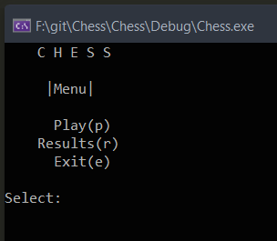
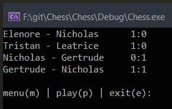
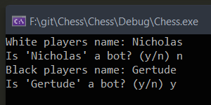
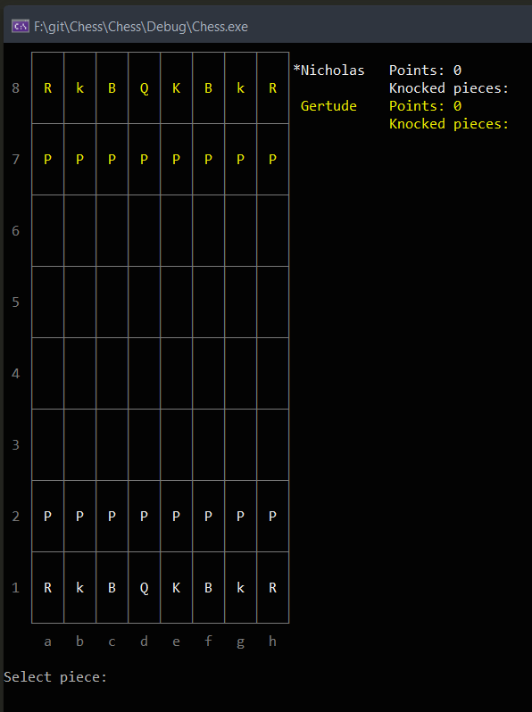
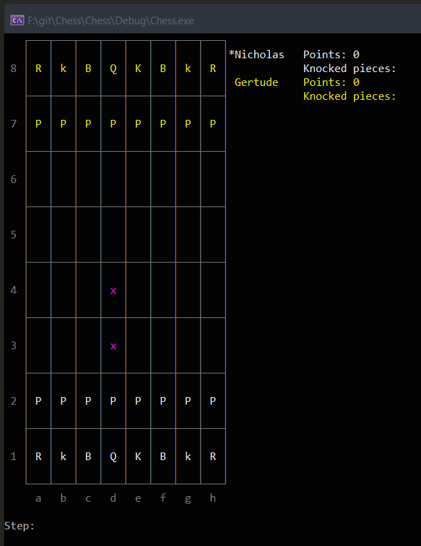
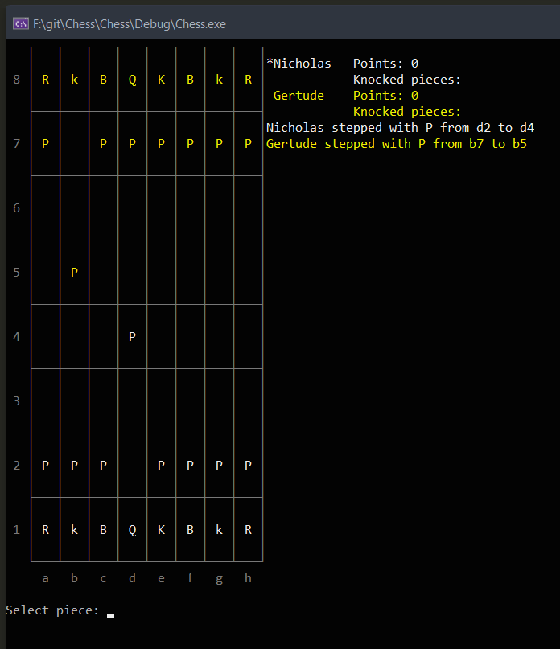

# Chess

Konzolos sakk program.

A tárgy kódja, amire elkészült ez a program: **GKNB_INTM026**

A játékot windows-on írtam Visual Studioban, viszont a `linux` mappában egy QT creatorban elkészített mása található a játéknak, lefordított változatával együtt.

Windows-on és linuxon máshogy kell színezni a konzolt, viszont ezt lekezeli a program, mivel mindenképpen szükséges ennél a játéknál színezni a két játékos bábuit.

- [Chess](#chess)
  - [Felhasználói dokumentáció](#felhasználói-dokumentáció)
    - [Menü](#menü)
    - [Játék menete](#játék-menete)
      - [Játék kezdete](#játék-kezdete)
      - [Játék folyamata](#játék-folyamata)
      - [Játék vége](#játék-vége)
  - [Gép elleni játék](#gép-elleni-játék)
    - [Gépi játékos logikája](#gépi-játékos-logikája)
      - [Bábuk értéke](#bábuk-értéke)
  - [Fejlesztői dokumentáció](#fejlesztői-dokumentáció)
    - [Osztályok](#osztályok)
    - [Program felépítése](#program-felépítése)
      - [Color](#color)
      - [Field](#field)
      - [GameManager](#gamemanager)
      - [Grid](#grid)
      - [InputManager](#inputmanager)
      - [Piece](#piece)
      - [PieceManager](#piecemanager)
      - [PieceType](#piecetype)
      - [Player](#player)
      - [Position](#position)
      - [RuleManager](#rulemanager)
      - [Chess](#chess-1)

## Felhasználói dokumentáció

### Menü



- Play
  
  Ha ezt választjuk, akkor elindul a játék.

  Ehhez beírhatjuk a `Select:` után a következőket: **Play**, **play**, **p**, **P**
- Results
  
  Ha ezt a menüpontot választjuk, a program megjeleníti az eddigi elmentett játékok végeredményét.

  Ehhez beírhatjuk a `Select:` után a következőket: **Results**, **result**, **r**, **R**

  

- Exit

  Ezt választva kiléphetünk az alkalmazásból.

  Ehhez beírhatjuk a `Select:` után a következőket: **Exit**, **exit**, **e**, **E**

### Játék menete

#### Játék kezdete



A játék megkezdése előtt meg kell adni a **fehér** és a **fekete** térfélhez tartozó játékosok neveit, illetve azt hogy a játékos számítógép lesz e.

Választhatunk **ember** az **ember** elleni, **gép** az **ember** elleni, **ember** a **gép** elleni, illetve **gép** a **gép** elleni játékot.

Ezek után elindul a játék.



#### Játék folyamata

Amennyiben az adott játékos **ember**, a következő képpen kell lépni:

1. Választjuk ki azt a cellát, amelyiken az a bábu található, amelyikkel lépni szeretnénk.

   Ehhez először az **oszlop betű jelét**, utána pedig a **sor számát** kell megadnunk. Például: `d2`

   Ezután egy **lila x** fogja jelölni a táblán azokat a cellákat, ahova a választott bábuval lehet lépni.

    

2. Ezután azt a cellát kell megadnunk, ahova szeretnénk lépni. Például: `d4`

    

A játék minden lépés után kiírja a képernyőre hogy **melyik** **játékos** **melyik** **bábuval** **honnan** **hova** lépett. Az összes lépést el is menti egy szöveges fájlba, amit a program gyökér könyvtárában találhatunk. Például: `Nicholas-Gertrude_0-1_all_steps.txt`

#### Játék vége

Miután véget ért a játék, feljön egy kis menü, ahol visszatérhetünk a menübe, újrakezdhetjük a játékot, megnézhetjük az eddigi eredményeket, vagy kiléphetünk a játékból.

## Gép elleni játék

A gépi játékos(ok)ba beleépítettem egy álltalam kitalált logikát. Nem tud több lépéssel előre gondolkodni, viszont képes úgy megválasztani a következő lépését, hogy annak legyen értelme.

### Gépi játékos logikája

**Röviden**: Minden lehetséges lépését pontozza és azt fogja választani ami a legtöbb pontot kapta.

1. A gép a köre megkezdése előtt megnézi, hogy nincs e vége a játéknak, a másik játékos lépése végett. Ha sakk matt van, vagy csakis egy bábuja maradt *(a király)* vagy csakis egyetlen bábuja maradt amivel tud lépni *(a király)*, akkor véget ér a játék.
2. A gép azzal kezdi a körét, hogy megnézi, sakkban áll e. Ha igen, akkor megpróbál ellépni a királlyal. Ezt azért nézi meg a köre elején, mert ha később nézné meg, sokkal többet gondolkodna és sokkal lassabban lenne képes lépni.
3. Ha kiderült hogy az előző lépésben el tud lépni, ellép. Ha nem akkor a következőket nézi meg:
4. Először megnézi az ellenfél összes lehetséges lépését, majd mindegyiket pontozza. Külön pontozza az ellenfél és a saját lehetséges lépéseit.
   1. Megnézi, hogy ahova az ellenfél el tud lépni, ott le tud e ütni olyan bábut, ami a gépé. Ha igen, akkor az imént említett pontszámot megnöveli a leüthető bábu értékével. [A bábuk értéke](#Bábuk-értéke)
   2. Illetve ezt a bábut *(a sajátját, ami veszélyben lehet)* megjegyzi, amivel még később foglalkozni fog.
   3. Ha ez a kapott pontszám több, mint az eddigi eltárolt, akkor az eddigi eltárolt lesz ez a pontszám. Ez a pontszám az ellenfél pontszáma.
5. Ezután a saját bábuival megnézi az összes lehetséges lépést, és kipróbálja azokat. Mindegyik lépés végén pontozza azt és ha ez a pontszám nagyobb mint az eddigi legjobb lépés pontszáma, akkor ez a lépés lesz az eddigi legjobb lépés.
   1. A lépés végén megnézi még azt is, hogy ahova ellépett, ott az ellenfél le tudja e ütni ezt a bábut és ha igen, akkor ezt a bábut elmenti, ugyan úgy mint a 4.2.-ben.
   2. Ha ez a bábu az ellenfél álltal veszélyben lehet, a kör pontszámából levonja annak az ellenséges bábunak az értékét, ami veszélyezteti ezt.
6. Majd megnézi azokat a bábukat, amiket veszélyben vannak. Ezeket mentette el külön.
   1. Ha az adott bábu *(aminek a lépéseit viszgálja)* benne van ezekben a megjegyzett bábukban, végigmegy az összes lehetséges lépésén és ha el tud lépni úgy, hogy utána ne legyen veszélyeztetve ez a bábu álltal, akkor extra ponttal jutalmazza ezt a lépést. Ilyenkor annak a bábunak az értékét adja hozzá a pontszámhoz, ami veszélyeztette.
7. A kör végén, ha a kör pontszáma jobb mint az eddigié és ez az érték kisebb, mint az ellenfélé, akkor ez a lépés lesz a legjobb lépés.
8. Ha az az eset lépne fel, hogy a legjobb lépés pontszáma `0`, akkor véletlenszerűen választ bábut. Ez akkor fordulhat elő, amikor a játék elején vagyunk és még nem tud a gép leütni másik bábut. Amúgy pedig oda lép, ami a legjobb lépésként bizonyult.
9. Miután ellépett, megnézi hogy sakkban fog e állni, ha igen akkor kezdi az egészet elölről.
10. Ha sikerült egy **gyalogot** eljuttatnia az utolsó sorba, akkor azt **királynővé** lépteti elő.

A gép nem lép szuper gyorsan, viszont nem is lép szuper lassan. Néha meg eshet hogy többet gondolkodik mint álltalában, ilyenkor a játék kiírja a képernyőre, hogy az adott gépi játékos éppen gondolkodik. Viszont van amikor eléggé gyorsan sikerül döntenie, ez főleg akkor történik meg, amikor a játék vége fele eléggé elfogytak a bábuk. Ezért a gép minden lépése előtt vár `1` másodpercet, csak hogy emberi szemmel követkető legyen kettő gépi játékos játéka, illetve ha gép ellen játszunk, akkor se válasszon túl gyorsan a gép.

#### Bábuk értéke

|     Bábu | Érték |
| -------: | :---- |
|   gyalog | 10    |
|   huszár | 20    |
|     futó | 30    |
|   bástya | 40    |
| királynő | 50    |
|   király | 60    |

## Fejlesztői dokumentáció

### Osztályok

- Field
- GameManager
- Grid
- InputManager
- Piece
- PieceManager
- Player
- Position
- RuleManager

### Program felépítése

#### Color

Ez egy felsorolás típus. Itt vannak meghatározva a bábuk színei. Egy bábu színe lehet **fehér**, illetve **fekete**. Ezen felül itt egy **semmilyen** típus is meg van adva.

```c++
enum class Color
{
  White, Black, Nothing
};
```

#### Field

Ez az osztály egyetlen mezőt képvisel. Minden mezőnek van pozíciója, színe és egy bábuja. Ez a bábu lehet üres is.

```c++
std::shared_ptr<Position> position;
std::shared_ptr<Piece> piece;
Color color;
```

#### GameManager

Ez az osztály felelős a játék irányításáért.

Ez az osztály a **singleton desing pattern**-t követi.

```c++
private:
	GameManager() {}
	static GameManager* instance;
public:
	static GameManager* Instance();

GameManager* GameManager::Instance() {
	if (!instance) {
		instance = new GameManager();
	}
	return instance;
}
```

Itt vannak eltárolva a kettő játékos és a játék állapota.

A `StartGame` függvénnyel lehet elindítani a játékot.

A `ReStartGame` függvénnyel lehet újraindítani a játékot.

A `GameOver` illetve a `GiveUp` függvénnyel pedig végetvetni a játéknak.

#### Grid

Ebben az osztályban tárolódik el maga a tábla, amin a játék játszódik.

```c++
std::vector<std::vector<std::shared_ptr<Field>>> grid;
```

Az `InitGrid` függvény létrehozza a táblát, a `DrawGrid` pedig kirajzolja azt a képernyőre.

A program a fehér bábukat fehér színnel, a fekete bábukat sárga színnel, illetve a tábla felosztását és a sorok, oszlopok jeleit szürke színnel rajzolja ki.

#### InputManager

Ez a függvény felelős az emberi és a gépi játékos lépéséért.

Ez az osztály a **singleton desing pattern**-t követi.

```c++
private:
	InputManager() {}
	static InputManager* instance;
public:
	static InputManager* Instance();

InputManager* InputManager::Instance() {
	if (!instance) {
		instance = new InputManager();
		srand(time(NULL));
	}
	return instance;
}
```

Fő függvénye a `ReadCommand`, ahol a gépi és az emberi játékos választott lépését vizsgálja meg a játék.

Ebben az osztályban kezeli le a játék a sakkot (`checkCheck`) és a sakk mattot (`checkCheckMate`).

Itt történik még egy gyalog előreléptetése, a `promotion` függvénnyel.

#### Piece

Ez az osztály felelős egy adott bábuért. Minden bábunak van **neve**, **pozíciója**, **színe** és **típusa**.

```c++
std::string name;
std::shared_ptr<Position> position;
Color color;
PieceType piece_type;
```

#### PieceManager

Ez az osztály felelős a bábuk eltárolásáért, illetve mozgatásukért.

Ez az osztály a **singleton desing pattern**-t követi.

```c++
private:
	PieceManager() {}
	static PieceManager* instance;
public:
	static PieceManager* Instance();

PieceManager* PieceManager::Instance() {
	if (!instance) {
		instance = new PieceManager();
	}
	return instance;
}
```

Az `InitPieces` függvény létrehozza a bábukat és a megfelelő mezőn helyezi el őket.

A `MovePiece` függvénnyel lehet lépni egy bábuval, a `RemovePiece` függvénnyel lehet leütni egy bábut, a `RevivePiece` függvénnyel lehet visszahozni egy bábut, illetve a `ChangePiece` függvénnyel lehet egy bábut átváltoztatni. Az utóbbi akkor lép érvénybe, amikor egy gyalog elérte az indulásához képest legtávolabbi sort.

#### PieceType

Ez egy olyan típus, amiben a bábuk típusai vannak felsorolva.

| bábu neve | típusa   |
| --------: | :------- |
|    gyalog | `Pawn`   |
|    bástya | `Rook`   |
|    huszár | `Knight` |
|      futó | `Bishop` |
|  királynő | `Queen`  |
|    király | `King`   |

Emellett egy **semmilyen** típus is definiálva van.

```c++
enum class PieceType
{
	Pawn, Rook, Knight, Bishop, Queen, King, Nothing
};
```

#### Player

Ez az osztály felelő egy játékosért. Minden játékosnak van **neve**, **pontszáma**, **színe**, **leütött bábujai**, illetve hogy **gépi játékos e**.

```c++
std::string name;
int points;
Color color;
std::vector<std::shared_ptr<Piece>> off_pieces;
bool is_bot;
```

#### Position

Ez az osztály felelős egy bábunak a **pozíciójáért**. Minden pozíciónak van **x** és **y** koordinátája.

```c++
int x;
int y;
```

#### RuleManager

Ebben az osztályban vannak definiálva a bábuk mozgatási szabályai.

Ez az osztály a **singleton desing pattern**-t követi.

```c++
private:
	RuleManager() {}
	static RuleManager* instance;
public:
	static RuleManager* Instance();

RuleManager* RuleManager::Instance() {
	if (!instance) {
		instance = new RuleManager();
	}
	return instance;
}
```

A `CanStep` függvény dönti el, hogy egy bábuval hova lehet lépni.

#### Chess

Itt található a `main` függvény, ami elindítja a játékot.
